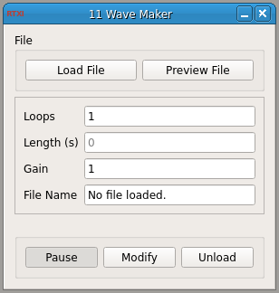

###Wave Maker

**Requirements:** Qwt, Plot helper classes (included)  
**Limitations:** none noted   

<!--start-->
This module loads data from an ASCII formatted file. It samples one value from the the file on every time step and creates and generates an output signal. The module computes the time length of the waveform based on the current real-time period. This is an easy way to test your algorithms on pre-recorded data as if it were being acquired in real-time. This module is already included in RTXI v1.3+ by default. You may download this source code and edit it. Compiling and installing this module will overwrite the bundled version of Wavemaker.
<!--end-->

####Output Channels
1. output(0) – “Output” : values read from the ASCII file

####Parameters
1. Loops : Number of times to repeat the waveform, looping back to the beginning
2. Gain : Multiplicative gain to apply to the waveform values

####States
1. Length(s) : Length of trial, computed based on the real-time period in RTXI

####Comment
1. File Name : Name of ASCII input file  
